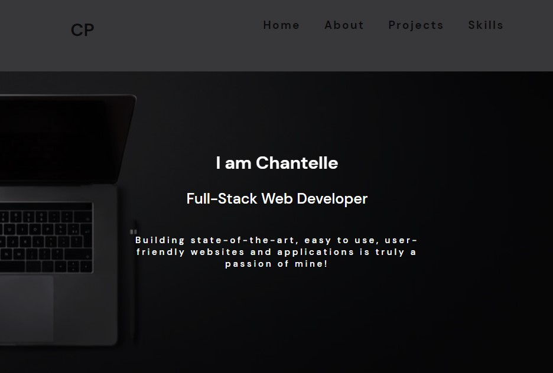

<h2 align="center">
Portfolio Web Application  
Chantelle Pasceri
</h2>

## Built With

My personal portfolio was built using these technologies:

- React.js
- SASS
- VsCode
- React-Router
- React-Icons

## Features

Features some of my github projects as well as my technical skills  
 
**📱 Fully Responsive**
**🎨 Styled with Sass**

## 🛠 Installation and Setup Instructions

1. Installation: `npm install`

2. In the project directory, you can run: `npm start`

Runs the app in the development mode.\
Open [http://localhost:3000](http://localhost:3000) to view it in the browser.
The page will reload if you make edits.

### Deployment

[https://cpasceri.netlify.app/](https://cpasceri.netlify.app/ “My Portfolio Website”)

